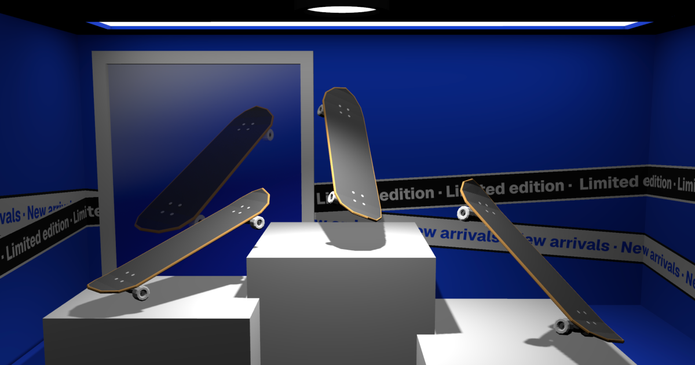

# Escaparate



Escaparate 3D interactivo de una tienda de skateboards, hecho con [Vite](https://vite.dev) y [Three.js WebGPU](https://threejs.org/docs/#api/en/renderers/webgpu/WebGPURenderer) (`three/webgpu` + TSL), con una arquitectura de clases inspirada en [folio-2025](https://github.com/brunosimon/folio-2025).

**Demo:** [nestorrig.github.io/escaparate](https://nestorrig.github.io/escaparate/) · Hecho por [@nestorrig](https://nestorrig.com)

## Qué tiene

- **Skates interactivos:** al pasar el cursor pulsan con emissive (raycaster) y al hacer clic hacen un kickflip animado con GSAP.
- **Materiales animados en TSL:** pared de ladrillo para la construcción, letrero grande con scroll infinito y dos cintas ("New arrivals" y "Limited edition") que recorren las tres paredes del escaparate y se cruzan.
- **Iluminación:** RectAreaLights sobre las lámparas, un SpotLight con sombras sobre los skates y entornos HDRI seleccionables.
- **Cámara:**
  - Desktop: vistas *Outdoor* e *Indoor* con transición GSAP y parallax con el cursor.
  - Mobile: OrbitControls centrados en el escaparate, sin poder ver más allá de la fachada.
- **Michelle:** personaje animado frente al escaparate.

## Scripts

```bash
npm install
npm run dev      # servidor de desarrollo (abierto a la red local)
npm run build    # build de producción en dist/
npm run preview  # sirve el build
npm run deploy   # build + publica dist/ en la rama gh-pages
```

## Deploy en GitHub Pages

`npm run deploy` construye el proyecto y sube `dist/` a la rama `gh-pages` con [gh-pages](https://github.com/tschaub/gh-pages). En GitHub, en **Settings → Pages**, la fuente debe ser *Deploy from a branch* con la rama `gh-pages` y la carpeta `/ (root)`.

Vite usa `base: './'`, así que el sitio funciona en cualquier subruta (`/escaparate/`) sin configurar nada más.

## Parámetros de URL

- `#inspector`: activa el Inspector de three (rendimiento, memoria y parámetros de luces, materiales y cámara).
- `?quality=1|2|3`: fuerza el nivel de calidad (pixel ratio, tamaño de sombras).
- `?mobile`: fuerza el modo móvil (cámara con OrbitControls) en desktop.

## Estructura

```
public/
  models/                 escaparate_2_v4.glb, Michelle.glb
  textures/               poster, letreros y cintas de las paredes
  hdri/                   entornos para el selector de iluminación
  favicon/                íconos y site.webmanifest
  detalles/               imágenes de las anotaciones
  og_image.png            imagen para redes sociales y este README
src/
  index.html, index.js, style.css
  data/pieces.js          datos de las anotaciones (poster, móvil)
  Experience/
    Experience.js         singleton que crea y orquesta todos los módulos
    Events.js             eventos con orden de ejecución
    Ticker.js             loop (lo mueve renderer.setAnimationLoop)
    Viewport.js           tamaño y pixel ratio
    Quality.js            niveles de calidad según el dispositivo
    ResourcesLoader.js    GLTF, texturas y HDR + barra de carga
    Rendering.js          WebGPURenderer, toneMapping, Inspector
    View.js               cámara: vistas Outdoor/Indoor + parallax en desktop, OrbitControls en mobile
    Lighting.js           HDRI, RectAreaLights en las lámparas y SpotLight con sombras
    Overlay.js            fade de entrada
    Annotations.js        puntos HTML proyectados con oclusión por raycast (sin usar por ahora)
    Modal.js              detalle de cada pieza (sin usar por ahora)
    World/
      World.js            agrupa la escena en las coordenadas del glb
      Escaparate.js       texturas, cintas, letrero animado y flotación de los skates
      AnimatedMaterials.js  materiales TSL: ladrillo, pixel y cintas
      SkatesInteraction.js  hover con emissive y kickflip al hacer clic
      Michelle.js         personaje animado frente al "marco"
      Mirror.js           espejo con FBO (sin usar en esta escena)
```

## Orden del tick

1. `World` (flotación, animación, interacción) y `View` (cámara)
2. `Rendering` renderiza el frame final
